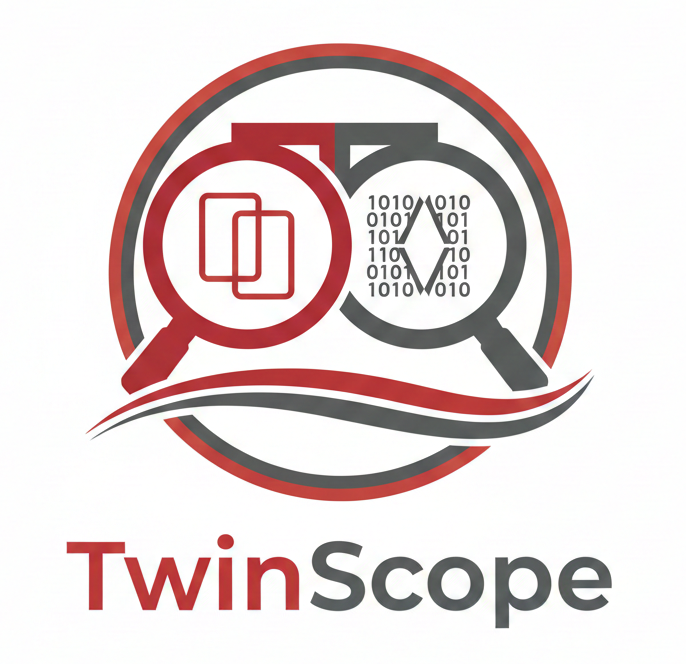

# TwinScope

<p align="center">
  
</p>

<p align="center">
  <strong>A professional file and folder comparison tool</strong>
</p>

<p align="center">
  <a href="#features">Features</a> •
  <a href="#installation">Installation</a> •
  <a href="#usage">Usage</a> •
  <a href="#building-the-installer">Building the Installer</a> •
  <a href="#license">License</a>
</p>

<p align="center">
  
  
  
  
</p>

---

## Overview

TwinScope is a cross-platform file and folder comparison tool inspired by Beyond Compare. Built with Python and PyQt6, it provides a clean, responsive interface for comparing text files, binary files, images, and entire directory trees. It includes advanced features like three-way merging, folder synchronization, and report generation.

## Features

### 📄 Text File Comparison
- **Side-by-Side & Unified Views**: Toggle between traditional split view and unified diff view.
- **Syntax Highlighting**: Built-in support for multiple programming languages.
- **Synchronized Scrolling**: Effortlessly navigate through large files.
- **Intraline Highlighting**: See character-level changes within lines.
- **Customizable Options**: Ignore whitespace, case, line endings, and blank lines.

### 📁 Folder Comparison
- **Tree View**: Color-coded visualization of directory differences (Modified, Identical, Left-only, Right-only).
- **Recursive Comparison**: Compare entire directory trees with high performance.
- **Lazy Loading**: Efficiently handles folders with thousands of files.
- **Quick Preview**: Preview file contents directly from the folder comparison view.

### 🔀 Three-Way Merge
- **Conflict Resolution**: Interactive UI to resolve merge conflicts between base, left, and right versions.
- **Automatic Resolution**: Automatically resolve simple non-conflicting changes.
- **Direct Editing**: Edit the merged output directly within the application.

### 🔍 Advanced Tools
- **Binary Comparison**: Compare files at the byte level with a dedicated hex view.
- **Image Comparison**: Side-by-side comparison for visual assets (PNG, JPG, WebP, etc.).
- **Folder Synchronization**: Keep directories in sync with customizable rules.
- **Hash Verification**: Verify file integrity using MD5, SHA-1, SHA-256, or SHA-512.
- **Report Generation**: Export comparison results to structured reports.

### 🎨 User Interface
- **Modern Themes**: Support for Dark and Light modes with system theme detection.
- **Sidebar Navigation**: Quick access to recent comparisons.
- **Drag & Drop**: Easily drop files or folders to start a new comparison.
- **Dockable Panels**: Flexible UI layout to suit your workflow.

## Installation

### Requirements

- Python 3.10 or newer
- PyQt6 6.4 or newer

### Install from Source

```bash
# Clone the repository
git clone https://github.com/dipta-roy/TwinScope.git
cd TwinScope_v1.0

# Create and activate a virtual environment
python -m venv venv
venv\Scripts\activate  # On Windows

# Install dependencies
pip install -r requirements.txt
```

## Usage

### Graphical Interface

Run the application using the following command:

```bash
python main.py
```

### Command Line

TwinScope supports passing paths directly:

```bash
python main.py [left_path] [right_path]
```

### Windows (.exe)
Download PlanIFlow `TwinScope 1.0.exe`:
Download Code Verification Certificate: [Dipta Roy - Code Verification Certificate](https://github.com/dipta-roy/dipta-roy.github.io/blob/main/downloads/Code%20Verifying%20Certificates.zip).
```
- HOW TO TRUST

1. Unzip the distribution package.
2. Double-click: Signed_By_Dipta_CodeSigningPublicKey.cer
3. Click: "Open" -> "Install Certificate..."
4. Select: "Current User"
5. Choose: "Place all certificates in the following store"
6. Browse -> "Trusted People" -> OK -> Next -> Finish

- VERIFY APPLICATION AUTHENTICITY

1. To confirm the application is genuine, open its Properties.
2. Go to the Digital Signatures tab.
3. Select "Signed_By_Dipta" from the Embedded Signatures list, then choose Details.
4. In the General tab, you should see the message "This digital signature is OK." which confirms the app was signed by Dipta using the listed certificates.
```

Once verified,
```
Run TwinScope 1.0.exe and install the application.
```

## Keyboard Shortcuts

| Shortcut | Action |
| :--- | :--- |
| **General** | |
| `Ctrl+O` | Compare Files |
| `Ctrl+Shift+O` | Compare Folders |
| `Ctrl+M` | Three-Way Merge |
| `Ctrl+S` | Save |
| `Ctrl+W` | Close Current Tab |
| `Ctrl+Q` | Exit Application |
| **Navigation** | |
| `F8` | Next Difference |
| `Shift+F8` | Previous Difference |
| `Ctrl+Home` | Go to First Difference |
| `Ctrl+End` | Go to Last Difference |
| `Ctrl+G` | Go to Line... |
| **Edit** | |
| `Ctrl+F` | Find |
| `F3` | Find Next |
| `Alt+Right` | Copy Left to Right |
| `Alt+Left` | Copy Right to Left |
| **View** | |
| `F5` | Refresh Comparison |

## Building the Installer

TwinScope includes a streamlined build process for creating a Windows installer.

1. **Prerequisites**: Ensure you have `pyinstaller` installed (`pip install pyinstaller`).
2. **Run Build Script**:
   ```powershell
   .\TwinScope_build_installer.bat
   ```
3. **Packaging**: The script will first build the core application and then package it into a self-extracting installer located in the `dist/` directory.

## License

This project is licensed under the MIT License - see the [LICENSE](LICENSE) file for details.

## Acknowledgments

- [PyQt6](https://www.riverbankcomputing.com/software/pyqt/) - The UI framework used.
- [Beyond Compare](https://www.scootersoftware.com/features.php) - For the inspiration.
- All contributors who have helped shape TwinScope.

<p align="center">Made with ❤️ by Dipta Roy</p>

